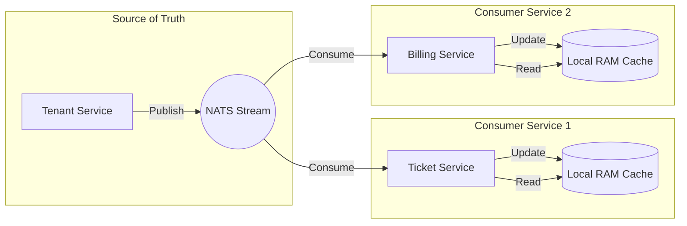

# I9 Networks - Custom Authentication Architecture

## 🏗️ **Architecture Overview**

### **Simplified 2-System Architecture**
```
Request → Custom Auth Service (Auth + Business) → Casbin (Authz) → Response
```

### **Service Responsibilities**

#### **🎯 Custom Auth Service**
- **Authentication**: JWT token generation/validation, password hashing, session management
- **User Management**: Extended user profiles with multi-assignment system
- **Business Logic**: Multi-zone/department assignments, context-aware permissions
- **Event Publishing**: Real-time events for other services
- **Security**: Rate limiting, account lockout, audit logging

#### **🎯 Casbin**
- **Authorization**: Policy-based access control
- **Permission Enforcement**: Context-aware permission validation
- **Role Management**: Dynamic role and permission management

## 🛡️ **Universal Tenant Hierarchy Guard**

The library enables a **Distributed Guard Pattern** to enforce tenant data isolation across all microservices (`ticket-service`, `billing-service`, etc.) without centralized bottlenecks.

### **Core Concept: "Distributed In-Memory Replication"**

Instead of calling Redis or `tenant-service` API for every request (Network Latency), each service maintains its own **Local In-Memory Tenant Database** that is event-driven and eventually consistent.

**Why In-Memory > Redis for this use case?**
1.  **Zero Latency**: Permission checks happen in nanoseconds (RAM lookup) vs milliseconds (Redis RTT).
2.  **Decentralization**: If Redis or Tenant Service goes down, other services continue to function using their last known valid state (Cached).
3.  **Isolation**: Each service owns its operational data; no "Noisy Neighbor" problems on a shared Redis instance.

### **Architecture Topology**



### **Core Components**

1.  **`caching/hierarchy` (The Local Database)**
    -   Stores a lightweight graph of all tenants (`ID`, `Ancestors`, `Level`).
    -   Kept in sync via `TenantStream` events (`TenantCreated`, `TenantUpdated`, `TenantDeleted`).
    -   **Memory Efficient**: Only stores strictly necessary security context, not full profiles.

2.  **`middleware/guard` (The Enforcer)**
    -   **TenantHierarchyGuardMiddleware**: Blocks traffic unless `ResourceTenant` is a descendant of `ContextTenant`.
    -   **SystemLevelGuardMiddleware**: Restricts access to System Tenants or Super Admins.

### **Integration Workflow for New Services**

To add the guard to `ticket-service` or `auth-service`:

1.  **Wiring (`wire.go`)**:
    -   Inject `hierarchy.NewInMemoryCache`.
    -   Inject `events.NewNatsListener` (from common).

2.  **Startup (`app.start.go`)**:
    -   **Warm Up**: Fetch initial snapshot from `tenant-service` (optional but recommended for cold starts).
    -   **Sync**: Start `cache.StartSync(streamManager)` to begin consuming real-time events.

3.  **Router (`api.go`)**:
    -   Apply the middleware to tenant-scoped routes:
    ```go
    // Protect /api/v1/tickets/{tenantID}
    r.Use(guard.TenantHierarchyGuardMiddleware(
        container.CommonTenantCache,
        guard.ExtractFromPath("tenantID"),
    ))
    ```

This ensures that `ticket-service` can independently assert:
> *"I know for a fact that User from Tenant A is allowed to see Tenant B's tickets because my local graph says A is an ancestor of B."*

## 📈 **Production Readiness & Scaling Analysis**

### **1. Memory Footprint at Scale (1M - 10M Tenants)**

The distributed in-memory pattern trades **Relatively Cheap RAM** for **Zero-Latency Authorization**.

| Tenant Count | Struct Overhead (Est) | Ancillary Maps | Total RAM Usage | Feasibility |
| :--- | :--- | :--- | :--- | :--- |
| **10,000** | ~5 MB | ~2 MB | **~7 MB** | ✅ Trivial |
| **100,000** | ~50 MB | ~20 MB | **~70 MB** | ✅ Very Low |
| **1,000,000** | ~500 MB | ~200 MB | **~700 MB** | ✅ Standard Microservice (1GB pod) |
| **10,000,000** | ~5 GB | ~2 GB | **~7 GB** | ⚠️ High Memory Node Required |

**Conclusion**: For up to **5 Million Tenants**, this architecture fits comfortably within standard Kubernetes pod resource limits (2GB - 4GB RAM).

### **2. Bandwidth & Startup Dynamics**

**Cold Start "Dump and Load"**
-   Fetching 1 Million tenants via JSON payload (~300MB uncompressed) can take 5-10 seconds.
-   **Mitigation**: The `caching/hierarchy` module supports **GZIP Compression** and **Streaming decoders** to keep memory/cpu spikes low during startup.

**NATS Update Volume**
-   Assuming 1% daily churn (10k updates/day for 1M tenants) -> Extremely low load (<1 msg/sec).
-   Even massive bulk updates (re-parenting a reseller) creates minimal traffic compared to application data logs.

### **3. Scaling Beyond 10M Tenants (The "Meta-Scale" Strategy)**

If the tenant base exceeds 10M+, the architecture supports scaling strategies without breaking the interface:

1.  **Sharded Caching**:
    -   Router middleware computes `hash(tenantID) % shards`.
    -   Only load 1/Nth of the tenants into memory per pod (Stateless -> Stateful routing required).
2.  **Hybrid LRU Cache**:
    -   Keep "Active" tenants in RAM.
    -   Fallback to Redis for "Cold" tenants (Accepting the latency penalty only for tail-end users).
    -   *Note: This breaks the "Zero Latency" guarantee for cold tenants but saves RAM.*
3.  **Optimized Data Structures**:
    -   Replace `[]string` Ancestors with `Roaring Bitmaps` (using Integer IDs mapped to UUIDs).
    -   Reduces memory footprint by ~90%.

### **4. Resilience & Circuit Breaking**

-   **NATS Outage**: Service continues serving traffic using *last known state*.
-   **Tenant Service Down**: New tenants cannot be created/synced, but *existing traffic is unaffected*.
-   **Memory Pressure**: Check `cache.Size()` metrics. If RAM > 90%, the service acts as a "Circuit Breaker" and can fail-open or fail-closed based on config (Fail-Closed recommended for security).

## 🎯 **Multi-Tenant Assignment System**

### **User Access Structure**
```typescript
// User with multiple tenant assignments
const user = {
  id: "user-123",
  firstName: "John",
  lastName: "Doe",
  email: "john@company.com",
  password: "hashed_password",
  userAccess: [
    {
      tenantID: "TenantA",
      role: "field-engineer",
      isPrimary: true,
      isActive: true
    },
    {
      tenantID: "TenantB", 
      role: "field-sales",
      isPrimary: false,
      isActive: true
    },
    {
      tenantID: "TenantC",
      role: "support-engineer",
      isPrimary: false,
      isActive: true
    }
  ],
  extendedProfile: {
    mobile: "+1234567890",
    whatsapp: "+1234567890",
    gender: "male",
    dob: "1990-01-01",
    permanentAddress: {...},
    currentAddress: {...}
  },
  isActive: true,
  createdAt: "2025-01-01T00:00:00Z",
  updatedAt: "2025-01-01T00:00:00Z"
}
```

### **JWT Token with Multi-Tenant Context**
```json
{
  "sub": "user-123",
  "name": "John Doe",
  "email": "john@company.com",
  "iat": 1640908800,
  "exp": 1640995200,
  
  // Multi-tenant context
  "currentTenantID": "TenantA",
  "currentRole": "field-engineer",
  "isPrimary": true,
  "allAssignments": [
    {
      "tenantID": "TenantA",
      "role": "field-engineer",
      "isPrimary": true,
      "isActive": true
    },
    {
      "tenantID": "TenantB",
      "role": "field-sales",
      "isPrimary": false,
      "isActive": true
    }
  ],
  
  // Permissions (calculated from Casbin)
  "permissions": ["user:read", "field:manage", "zone:access"],
  
  // Business context
  "context": {
    "timeRestriction": "9:00-18:00",
    "locationRestriction": "TenantA-Region",
    "deviceRestriction": "company-devices"
  }
}
```

## 🔄 **Authentication Flow**

### **User Login Flow**
```typescript
1. User submits credentials
POST /api/auth/login
{
  "email": "john@company.com",
  "password": "password123"
}

2. Custom Auth Service validates credentials
3. Generates JWT with multi-tenant context
4. Returns enhanced token with all assignments

Response:
{
  "user": {...},
  "token": "jwt_with_multi_tenant_context",
  "refreshToken": "refresh_token",
  "expiresIn": 3600
}
```

### **Permission Check Flow**
```typescript
1. User makes request with JWT
GET /api/tenants/TenantA/users
Headers: Authorization: Bearer jwt_token

2. Custom Auth Service validates JWT
3. Extracts current tenant context
4. Checks Casbin permissions
5. Applies business rules
6. Returns response or error
```

### **Context Switching Flow**
```typescript
1. User switches to different tenant
POST /api/auth/context/switch
{
  "tenantID": "TenantB"
}

2. Custom Auth Service validates assignment
3. Generates new JWT with updated context
4. Returns new token

Response:
{
  "token": "new_jwt_with_updated_context",
  "expiresIn": 3600
}
```

## 🎯 **API Endpoints**

### **Authentication Endpoints**
```typescript
POST /api/auth/register     // Create user with multi-assignments
POST /api/auth/login        // Login with credentials
POST /api/auth/logout       // Logout and invalidate token
POST /api/auth/refresh      // Refresh access token
POST /api/auth/context/switch // Switch zone/department context
```

### **User Management Endpoints**
```typescript
GET    /api/users           // Get all users
GET    /api/users/{id}      // Get user by ID
PUT    /api/users/{id}      // Update user profile
DELETE /api/users/{id}      // Delete user

// Assignment Management
GET    /api/users/{id}/assignments           // Get user assignments
POST   /api/users/{id}/assignments          // Add new assignment
PUT    /api/users/{id}/assignments/{assId}  // Update assignment
DELETE /api/users/{id}/assignments/{assId}  // Remove assignment
```

### **Permission Endpoints**
```typescript
GET /api/permissions/user/{id}              // Get user permissions
POST /api/permissions/check                 // Check specific permission
GET /api/permissions/context/{zone}/{dept}  // Get context permissions
```

## 🏗️ **Implementation Plan**

### **Phase 1: Core Authentication (Week 1)**
**Goal**: Build basic authentication system

**Tasks**:
- [ ] **JWT Token System**: Generate/validate tokens with multi-tenant context
- [ ] **Password Authentication**: bcrypt hashing, password policies
- [ ] **User CRUD Operations**: Create, read, update, delete users
- [ ] **Session Management**: Redis-based session storage
- [ ] **Basic Security**: Rate limiting, account lockout

**Deliverables**:
- ✅ Custom Auth Service with JWT support
- ✅ User registration and login
- ✅ Basic security features
- ✅ Session management

### **Phase 2: Multi-Tenant Features (Week 2)**
**Goal**: Implement multi-assignment system

**Tasks**:
- [ ] **Multi-Assignment System**: Zone/department/role assignments
- [ ] **Context-Aware Permissions**: Zone/department specific access
- [ ] **Business Rule Engine**: Time, location, device restrictions
- [ ] **Assignment Management**: Add, update, remove assignments
- [ ] **Context Switching**: Switch between zone/department contexts

**Deliverables**:
- ✅ Multi-assignment user system
- ✅ Context-aware permission calculation
- ✅ Business rule enforcement
- ✅ Assignment management APIs

### **Phase 3: Casbin Integration (Week 3)**
**Goal**: Integrate Casbin for authorization

**Tasks**:
- [ ] **Casbin Setup**: Policy-based access control
- [ ] **Permission Calculation**: Dynamic permission aggregation
- [ ] **Context-Aware Policies**: Zone/department specific policies
- [ ] **Role Management**: Dynamic role and permission management
- [ ] **Policy Enforcement**: Real-time permission checking

**Deliverables**:
- ✅ Casbin integration
- ✅ Context-aware policies
- ✅ Dynamic permission calculation
- ✅ Real-time authorization

### **Phase 4: Advanced Features (Week 4)**
**Goal**: Add advanced security and business features

**Tasks**:
- [ ] **Multi-Factor Authentication**: OTP, WebAuthn, FaceID
- [ ] **Audit Logging**: Comprehensive activity tracking
- [ ] **Event Publishing**: Real-time events for other services
- [ ] **Performance Optimization**: Caching, query optimization
- [ ] **Security Enhancements**: Advanced security features

**Deliverables**:
- ✅ Multi-factor authentication
- ✅ Comprehensive audit logging
- ✅ Event-driven architecture
- ✅ Performance optimization

## 🎯 **Key Benefits**

### **✅ Complete Control**
- ✅ **JWT Structure**: Custom JWT with multi-tenant context
- ✅ **Password Policies**: Custom password policies and hashing
- ✅ **Session Management**: Custom session management
- ✅ **Business Rules**: Custom business rule enforcement
- ✅ **Event Publishing**: Custom event publishing system

### **✅ Simplified Architecture**
- ✅ **Single Auth Service**: One system instead of multiple
- ✅ **Direct Casbin Integration**: No integration complexity
- ✅ **Unified JWT Tokens**: Single token with all context
- ✅ **Single Source of Truth**: Everything in one place
- ✅ **No Cross-Service Calls**: Faster auth flow

### **✅ Better Performance**
- ✅ **No External Calls**: Direct database access
- ✅ **Optimized JWT Validation**: Fast token validation
- ✅ **Cached Permissions**: Permission caching
- ✅ **In-Memory Sessions**: Fast session storage
- ✅ **Event-Driven**: Real-time updates

### **✅ Multi-Assignment Support**
- ✅ **Multiple Zones**: User can work in ZoneA, ZoneB, ZoneC
- ✅ **Multiple Departments**: User can be in FieldTeam, SalesTeam, SupportTeam
- ✅ **Multiple Roles**: User can have different roles per zone/department
- ✅ **Primary Assignment**: One primary assignment for default context
- ✅ **Active/Inactive**: Enable/disable specific assignments

This architecture provides complete control over authentication and authorization while maintaining simplicity and performance! 🎉
